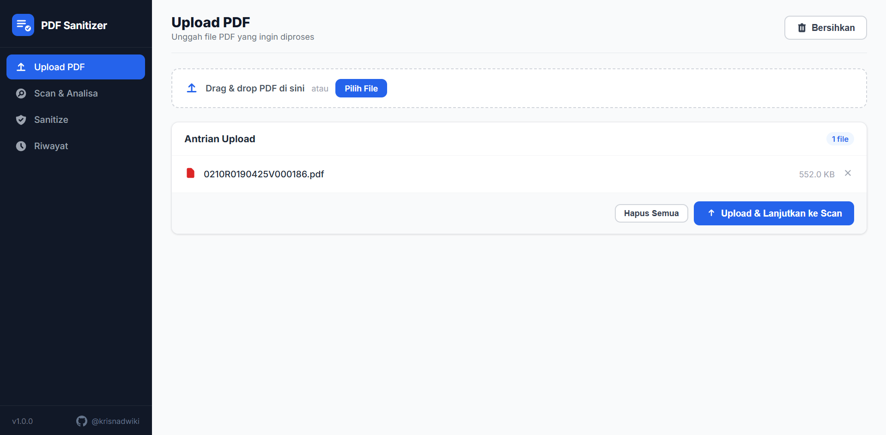
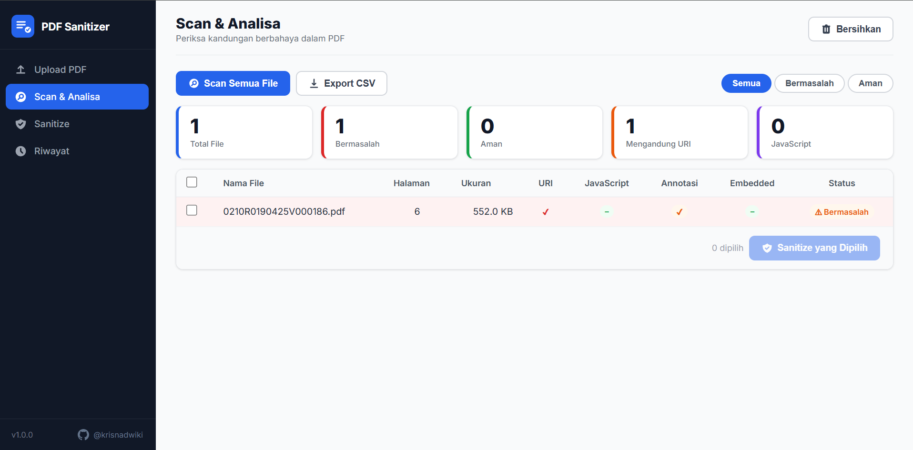
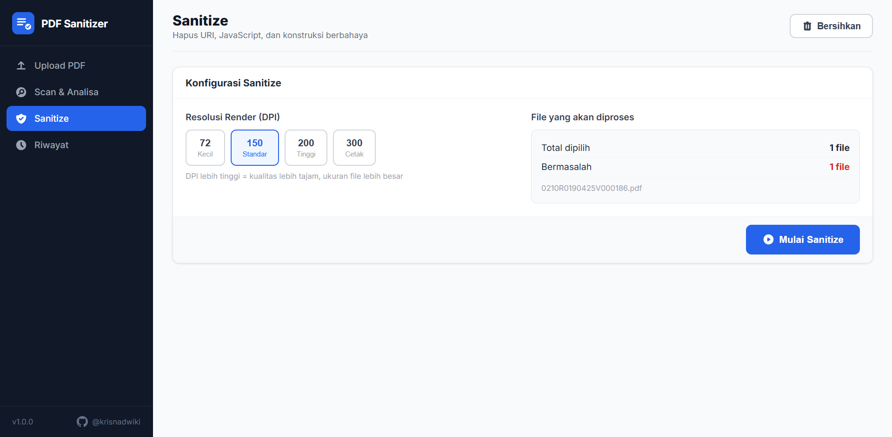

# PDF Sanitizer BPJS Drive

[](https://docs.docker.com/compose/)
[](https://fastapi.tiangolo.com/)
[](https://www.python.org/)

> Batch sanitasi PDF untuk menghilangkan `/URI`, JavaScript, OpenAction, dan Embedded Files  
> agar lolos validasi **JKN Drive BPJS** — tanpa perlu Print as PDF satu per satu.

**Repository:** https://github.com/krisnadwiki/PDF-Sanitizer

---

## Requirements

| Kebutuhan | Versi Minimum |
|-----------|---------------|
| Python | 3.10+ |
| Docker & Docker Compose | 24+ (opsional, untuk mode web/CLI tanpa install manual) |
| OS | Windows 10/11, Linux, macOS |

> **Mode Web & CLI** tidak membutuhkan PySide6.  
> **Mode GUI Desktop** membutuhkan Python 3.10–3.13 dan display (X11/Windows).

---

## Screenshots

### Web Interface





---

## Instalasi & Menjalankan

### Opsi 1 — Web Interface via Docker (paling mudah)

```bash
# 1. Clone repository
git clone https://github.com/krisnadwiki/PDF-Sanitizer.git
cd PDF-Sanitizer/pdf-sanitizer

# 2. Build image
docker compose build web

# 3. Jalankan
docker compose up web -d

# 4. Buka browser
# http://localhost:8000
```

Untuk menghentikan:
```bash
docker compose down
```

---

### Opsi 2 — Web Interface Lokal (tanpa Docker)

```bash
# 1. Clone repository
git clone https://github.com/krisnadwiki/PDF-Sanitizer.git
cd PDF-Sanitizer/pdf-sanitizer

# 2. Buat virtual environment
python -m venv venv

# Windows
venv\Scripts\activate

# Linux / macOS
source venv/bin/activate

# 3. Install dependensi web (lebih ringan, tanpa PySide6)
pip install -r requirements-web.txt

# 4. Jalankan server
python web_app.py

# 5. Buka browser
# http://localhost:8000
```

---

### Opsi 3 — CLI Batch Headless

```bash
# Lokal
pip install -r requirements-web.txt

python cli.py --input ./pdfs --output ./hasil --recursive --workers 4

# Scan only (tanpa convert)
python cli.py --input ./pdfs --scan-only

# Docker
mkdir -p data/input data/output
# Letakkan PDF di data/input
docker compose --profile cli run --rm cli
```

**Opsi CLI lengkap:**

| Flag | Default | Keterangan |
|------|---------|------------|
| `--input`, `-i` | _(wajib)_ | Folder sumber PDF |
| `--output`, `-o` | _(wajib untuk new_folder)_ | Folder tujuan |
| `--mode` | `new_folder` | `new_folder` / `replace` / `backup` |
| `--recursive`, `-r` | off | Rekursif ke subfolder |
| `--workers`, `-w` | `4` | Thread paralel |
| `--dpi` | `150` | Resolusi render (72–300) |
| `--skip-safe` | off | Lewati PDF yang sudah bersih |
| `--scan-only` | off | Hanya scan, tidak convert |

---

### Opsi 4 — Desktop GUI

```bash
# 1. Clone & masuk ke folder
git clone https://github.com/krisnadwiki/PDF-Sanitizer.git
cd PDF-Sanitizer/pdf-sanitizer

# 2. Buat virtual environment & aktifkan
python -m venv venv
venv\Scripts\activate        # Windows
source venv/bin/activate     # Linux/macOS

# 3. Install semua dependensi (termasuk PySide6)
pip install -r requirements.txt

# 4. Jalankan GUI
python app.py
```

**Catatan Python 3.13:**  
PySide6 versi lama (< 6.8) tidak support Python 3.13. `requirements.txt` sudah di-set ke `PySide6>=6.8.0` untuk kompatibilitas.

---

## Alur Web Interface

1. **Upload** — drag & drop atau klik "Pilih File" untuk memilih PDF
2. **Scan** — deteksi `/URI`, JavaScript, Annotasi, Embedded File per file → tampil tabel
3. **Sanitize** — centang file bermasalah, atur DPI, klik Mulai → progress real-time via WebSocket
4. **Download** — hasil dikemas otomatis sebagai ZIP

---

## Struktur Proyek

```
pdf-sanitizer/
├── app.py                   # Entry point GUI desktop (PySide6)
├── web_app.py               # Entry point web server
├── cli.py                   # Entry point CLI
├── requirements.txt         # Semua dependensi (web + GUI desktop)
├── requirements-web.txt     # Dependensi minimal (web + CLI saja)
├── Dockerfile               # Multi-stage: web / cli / gui
├── docker-compose.yml
├── img/                     # Folder screenshot untuk README
├── core/
│   ├── scanner.py           # Deteksi /URI, JS, dll. via pikepdf
│   ├── renderer.py          # Render ulang halaman via PyMuPDF
│   ├── sanitizer.py         # Orkestrasi scan + convert
│   ├── worker.py            # QThread untuk GUI desktop
│   └── logger.py
├── web/
│   ├── server.py            # FastAPI + WebSocket
│   └── static/              # HTML, CSS, JS frontend
└── gui/
    └── main_window.py       # Jendela utama PySide6
```

---

## Dependensi

| Paket | Versi | Fungsi |
|-------|-------|--------|
| PyMuPDF | 1.24.9 | Render halaman PDF |
| pikepdf | 9.3.0 | Analisa struktur PDF |
| FastAPI | 0.115.5 | Web framework |
| uvicorn | 0.32.1 | ASGI server |
| PySide6 | ≥ 6.8.0 | GUI desktop (opsional) |

---

## Docker — Referensi Cepat

```bash
# Web (akses di http://localhost:8000)
docker compose build web
docker compose up web -d
docker compose down

# CLI headless
docker compose --profile cli run --rm cli \
  python cli.py --input /input --output /output --recursive --workers 4

# GUI via X11 (Linux/WSL2)
xhost +local:docker
docker compose --profile gui up gui
```


---
## 📄 License
This project is licensed under MIT License - see the [LICENSE](LICENSE) file for details.

---

<div align="center">
  Built with ❤️ by Krisna Dwiki Aldi <br>
  Copyright © 2026. All rights reserved.
</div>

---